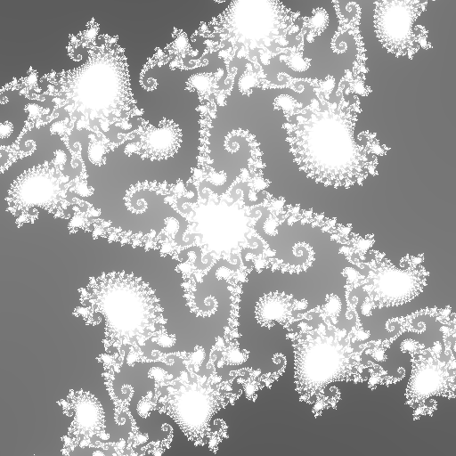
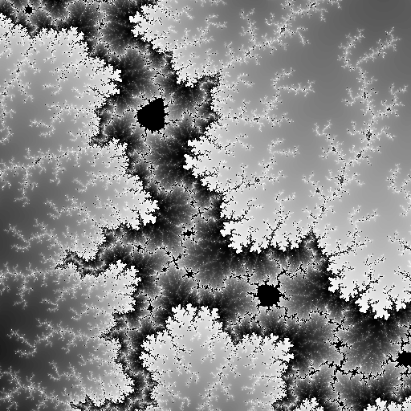

# Mandelbrot
Mandlebrot is a simple program designed to visualize the [Mandelbrot set](https://en.wikipedia.org/wiki/Mandelbrot_set)  


# Example Program

```python
import mandelbrot as m

m.set_view(center_x=-1.48316, center_y=0, zoom=0.0001)

m.save_image(
    m.create_image(
        width=1024,
        height=1024,
        iterations=512,
        color=m.color_options.basic), file_name='test', file_type='.png')
```

# Installation
Create a virtual environment in the root directory of the project:
```
python -m venv venv
```

Activate the virtual environment:
* Mac ```source venv/bin/activate```
* Windows ```venv\Scripts\activate```

Install the dependencies: 
```
pip install -r requirements.txt
```

## Libraries
**Pillow** - An image creation library  
**numba** - A JIT compiler  

# Functions
### Create Image
```python
def create_image(width: IMG_WIDTH, height: IMG_HEIGHT, iterations: ITERATIONS, color) -> Image:
```
Returns a PIL Image file that can be passed to the save function or manipulated 
on its own

**Parameters**
* **Width:** The width of the output image
* **Height:** The height of the output image
* **Iterations:** The number of times each pixel will be evaluated
* **Color:** A function that takes a value (x) and returns an RGB tuple within the range (0, 0, 0) to (255, 255, 255)

**Example**
```python
import mandelbrot as m

image = m.create_image(  
    width=1024,  
    height=1024,  
    iterations=512,  
    color=m.color_options.basic)
```

### Save Image
```python
def save_image(image: Image, directory=DEFAULT_IMAGE_DIRECTORY, file_name=DEFAULT_FILE_NAME, file_type=DEFAULT_FILE_TYPE):
```
Without specifying the directory, file name, or file type, this function will
default to the values specified in the config.py file

**Parameters**
* **Image:** A PIL image file
* **Directory (optional):** The file path to the save directory
* **File Name (optional):** The name of the file, for example: "test"
* **File Type (optional):** The file type, for example: ".png" or ".jpg"

**Example**
```python
import mandelbrot as m

image = m.create_image(  
    width=1024,  
    height=1024,  
    iterations=512,  
    color=m.color_options.basic)

m.save_image(image=image, file_name='test', file_type='.png')
```

### Set View
```python
def set_view(center_x, center_y, zoom):
```
Sets the view to be rendered

**Parameters**
* **Center X:** The center x coordinate
* **Center Y:** The center y (or i) coordinate
* **Zoom:** The level of zoom applied to the view

**Example**
```python
import mandelbrot as m

m.set_view(center_x=-1.5, center_y=0, zoom=0.5)
```

# Color Options
### Basic Black and White
```python
import mandelbrot as m

m.set_view(center_x=-0.745428, center_y=0.113009, zoom=3.0E-5)

m.save_image(
    m.create_image(
        width=512,
        height=512,
        iterations=512,
        color=m.color_options.basic), file_name='test', file_type='.png')
```
#### Output


###Banded Black and White

```python
import mandelbrot as m

m.set_view(center_x=-0.235125, center_y=0.827215, zoom=4.0E-5)

m.save_image(
    m.create_image(
        width=512,
        height=512,
        iterations=512,
        color=m.color_options.banded), file_name='test', file_type='.png')
```
#### Output


#License
This project is licensed under the MIT License - see the LICENSE.md file for details
